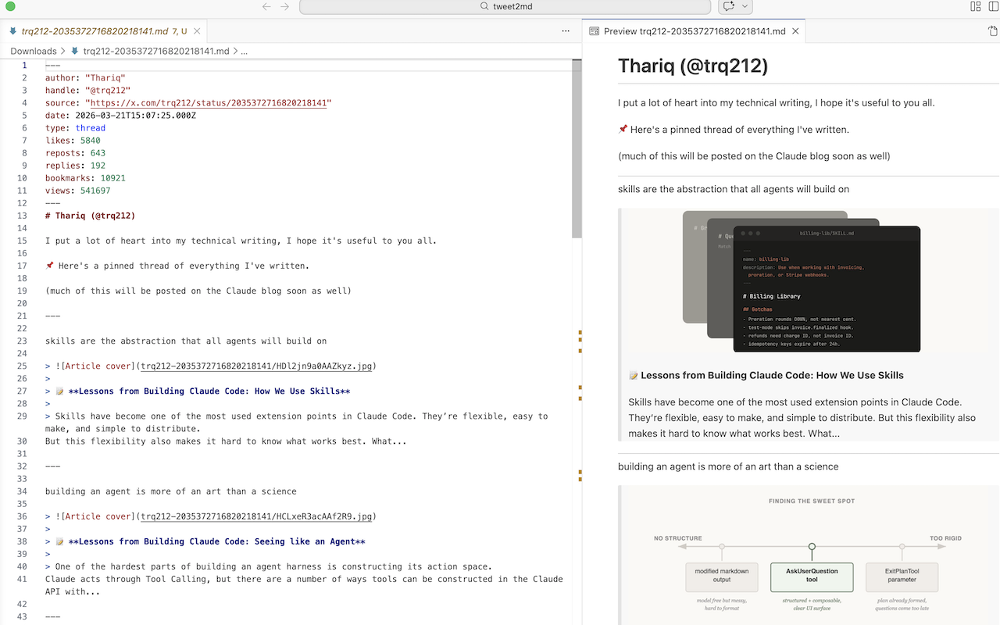

# tweet2md

> The ultimate Thread Downloader & Post Extractor for X / Twitter. Convert posts, long articles, and complex threads into clean Markdown — one click.

<p align="center">
  
</p>

## What it does

**tweet2md** is a Chrome extension that extracts tweets, threads, and long-form articles (X Notes) and downloads them as `.md` files.

### Supports

- **Tweets** — text, images, videos, resolved `t.co` links, inline emojis
- **Threads** — detects all tweets by the same author on the page, joined with `---` separators
- **Complex Content** — gracefully handles nested quote tweets, quoted articles, and mixed media layouts
- **Articles / Notes** — headings, bold/italic, bullet/ordered lists, code blocks, links, horizontal rules
- **Metadata** — optionally include metrics (likes, reposts, etc.) as **YAML frontmatter**
- **Image Downloads** — optionally download all images locally alongside the `.md` file
- **Clean output** — no engagement buttons, follow CTAs, or tracking clutter; @mentions stay inline

<p align="center">
  
</p>

## Install

### From Chrome Web Store

Install `tweet2md` from the [Chrome Web Store](https://chromewebstore.google.com/detail/tweet2md/epmmehilhbpkgcjbcohgkmihlalagkho)

### From source

1. Clone and build:

   ```bash
   git clone https://github.com/zendegani/tweet2md.git
   cd tweet2md
   npm install
   npm run build
   ```

2. Open `chrome://extensions/` → enable **Developer mode** → **Load unpacked** → select `dist/`

## Usage

1. Navigate to a tweet, thread, or article on **x.com**
2. Click the **tweet2md** icon
3. (Optional) Toggle **Save images locally** or **Include metadata**
4. Click **Download .md**
5. Files save to your Downloads folder

Filenames: `@handle-tweetId.md` (tweets/threads) or `@handle-article-slug.md` (articles).

## How it works

- Content script auto-injects on `x.com/*/status/*` pages
- **Tweets/threads**: Turndown.js with custom rules (t.co resolution, emoji inlining, @mention cleanup)
- **Articles**: Manual Draft.js block parsing for precise heading/list/code-block extraction
- DOM is cloned and cleaned (engagement bars, follow buttons, navigation stripped) before conversion
- Downloads via `chrome.downloads` API — nothing leaves your browser

## Permissions

| Permission   | Why |
|-------------|-----|
| `activeTab` | Read the current page's DOM when you click |
| `downloads` | Save the `.md` file and images to Downloads |
| `storage`   | Remember your popup toggle preferences |

**Your data never leaves your device. No data is collected, transmitted, or stored externally.** See [PRIVACY.md](PRIVACY.md).

## Tech stack

- **TypeScript** + **esbuild** (content IIFE, background ESM)
- **Turndown.js** — HTML → Markdown for tweets
- **Manifest V3**

## Project structure

```text
tweet2md/
├── src/
│   ├── content/        # DOM extraction + Turndown + Draft.js parsing
│   ├── background/     # Service worker (chrome.downloads)
│   ├── popup/          # Extension popup UI + trigger
│   ├── types/          # Shared TypeScript interfaces
│   ├── icons/          # Extension icons (16, 32, 48, 128px)
│   └── manifest.json   # Chrome MV3 manifest
├── dist/               # Build output (load this in Chrome)
├── build.mjs           # esbuild build script
├── package.json
└── tsconfig.json
```

## Development

```bash
npm install        # Install dependencies
npm run build      # Build for production
npm run watch      # Build + watch for changes
npm run package    # Package for Chrome Web Store (.zip)
npm run clean      # Clean build output
```

## License

MIT
