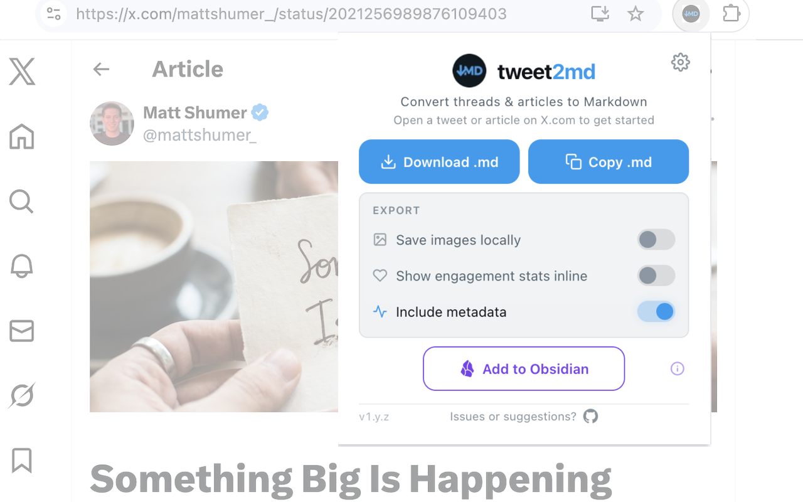
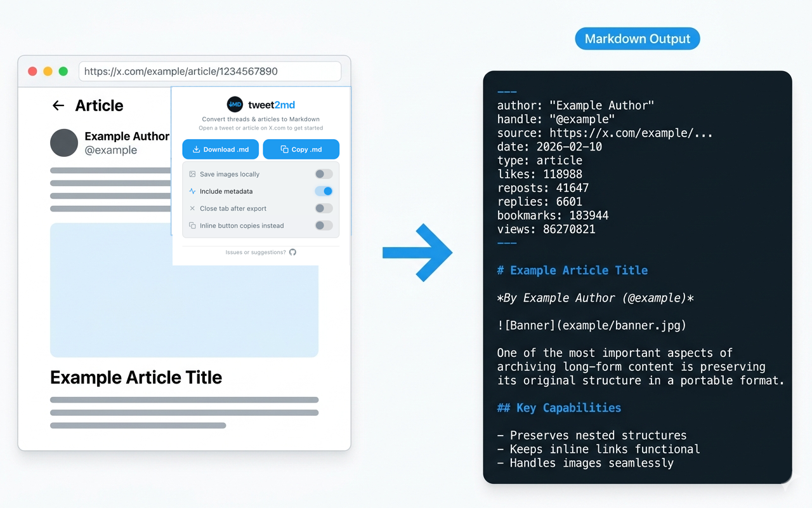

# tweet2md

> Copy or save X (Twitter) Articles, threads, and tweets as Markdown.

<p align="center">
  
</p>

## What it does

**tweet2md** is an open-source Chrome extension that turns x.com content into production-ready Markdown for research, note-taking, AI workflows, and offline archiving. No X API key required.

<p align="center">
  
</p>

### Key Features

- **X Articles** — Full support for long-form Articles (formerly Notes) with headings, lists, and code blocks
- **Tweets & Threads** — Extract tweets, nested threads, and quote tweets into clean Markdown
- **Quoted Posts** — Preserve quoted-post structure and context in a reusable format
- **Local Image Downloads** — Download all embedded images locally alongside your `.md` file to prevent link rot
- **YAML Frontmatter** — Rich metadata with author, handle, date, source URL, content type, and engagement stats (likes, reposts, replies, bookmarks, views)
- **Copy or Download** — Copy Markdown to clipboard or download as a file
- **Clean Output** — Automatically expand truncated posts and strip engagement buttons, follow prompts, and trackers
- **Multi-Language UI** — Popup available in English, Spanish, German, French, Japanese, Portuguese (Brazil), Chinese (Simplified), Arabic, and Persian. Content extraction works on any language regardless of UI translation
- **Light & Dark Mode** — Popup matches your system preferences

### Great For

- Importing X content into **Obsidian**, **Notion**, **Logseq**, **Hugo**, or any Markdown-based PKM system
- Exporting clean text for **LLM prompts**, **RAG pipelines**, or AI training workflows
- Archiving research threads, news references, and long-form articles offline
- Building a searchable **Second Brain** from your Twitter/X activity
- Preparing source material for writing, translation, or summarization

### Technical Specs

- **Format:** Markdown (.md) with YAML Frontmatter
- **Requirements:** No X API key required
- **Privacy:** Local-only execution (no server-side processing)
- **Architecture:** Zero-API — works directly in your browser with no API keys or accounts
- **Compatibility:** Supports X Articles (formerly Notes), nested threads, and media

## Install

### From Chrome Web Store

Install `tweet2md` from the [Chrome Web Store](https://chromewebstore.google.com/detail/tweet2md/epmmehilhbpkgcjbcohgkmihlalagkho)

### From source

1. Clone and build:

   ```bash
   git clone https://github.com/zendegani/tweet2md.git
   cd tweet2md
   npm install
   npm run build
   ```

2. Open `chrome://extensions/` → enable **Developer mode** → **Load unpacked** → select `dist/`

## Usage

1. Navigate to a tweet, thread, or article on **x.com**
2. Click the **tweet2md** icon
3. (Optional) Toggle **Save images locally** or **Include metadata**
4. Click **Download .md** to save the file, or **Copy .md** to copy to your clipboard
5. If downloaded, files save to your Downloads folder

Filenames: `@handle-tweetId.md` (tweets/threads) or `@handle-article-slug.md` (articles).

## How it works

- Content script auto-injects on `x.com/*/status/*` pages
- **Tweets/threads**: Turndown.js with custom rules (t.co resolution, emoji inlining, @mention cleanup)
- **Articles**: Manual Draft.js block parsing for precise heading/list/code-block extraction
- DOM is cloned and cleaned (engagement bars, follow buttons, navigation stripped) before conversion
- Downloads via `chrome.downloads` API — nothing leaves your browser

## Current Limitations

- Focused on x.com content extraction
- Videos and GIFs are not exported as playable media files
- Requires a page reload if the extension was installed or updated after opening the tab
- Some content may stop working if x.com changes its page structure significantly

## Permissions

| Permission   | Why |
|-------------|-----|
| `activeTab` | Read the current page's DOM when you click |
| `downloads` | Save the `.md` file and images to Downloads |
| `storage`   | Remember your popup toggle preferences |
| `host` (X.com) | Inject a content script on `x.com/*/status/*` to extract post or article content locally |

**Your data never leaves your device. No data is collected, transmitted, or stored externally.** See [PRIVACY.md](PRIVACY.md).

## Tech stack

- **TypeScript** + **esbuild** (content IIFE, background ESM)
- **Turndown.js** — HTML → Markdown for tweets
- **Manifest V3**

## Project structure

```text
tweet2md/
├── src/
│   ├── content/        # DOM extraction + Turndown + Draft.js parsing
│   ├── background/     # Service worker (chrome.downloads)
│   ├── popup/          # Extension popup UI + trigger
│   ├── types/          # Shared TypeScript interfaces
│   ├── icons/          # Extension icons (16, 32, 48, 128px)
│   ├── _locales/       # i18n translations (en, es, de, fr, ja, pt_BR, zh_CN, ar, fa)
│   └── manifest.json   # Chrome MV3 manifest
├── dist/               # Build output (load this in Chrome)
├── build.mjs           # esbuild build script
├── package.json
└── tsconfig.json
```

## Development

```bash
npm install        # Install dependencies
npm run build      # Build for production
npm run watch      # Build + watch for changes
npm run package    # Package for Chrome Web Store (.zip)
npm run clean      # Clean build output
```

## License

MIT
