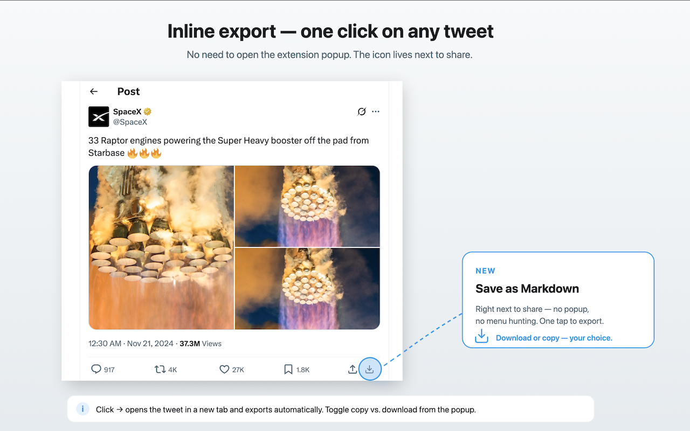
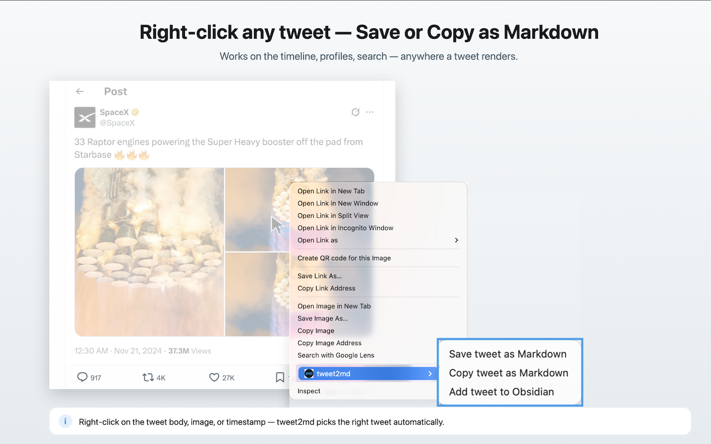
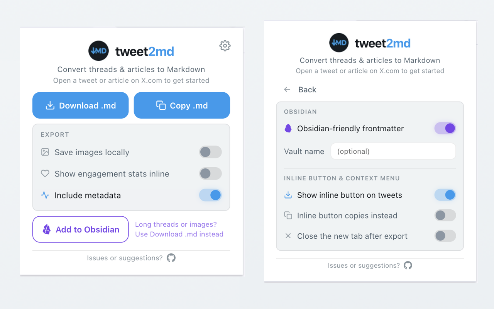

# tweet2md

[](https://github.com/zendegani/tweet2md/actions/workflows/ci.yml)
[](LICENSE)
[](https://chromewebstore.google.com/detail/tweet2md/epmmehilhbpkgcjbcohgkmihlalagkho)

> Copy or save X (Twitter) Articles, threads, and tweets as Markdown.

<p align="center">
  
</p>

## What it does

**tweet2md** is an open-source Chrome extension that turns x.com content into production-ready Markdown for research, note-taking, AI workflows, and offline archiving. No X API key required.

<p align="center">
  
</p>

### Key Features

- **Three Ways to Trigger** — Toolbar popup, inline button on every tweet's action bar, or the right-click context menu
- **X Articles** — Full support for long-form Articles (formerly Notes) with headings, lists, and code blocks
- **Tweets & Threads** — Extract tweets, nested threads, and quote tweets into clean Markdown
- **Single-Tweet Export** — Grab just one tweet without its thread via the right-click menu's **Copy just this tweet (no thread)** item, or by Shift/Alt-clicking the inline button
- **Quoted Posts** — Preserve quoted-post structure and context in a reusable format, with the original author's name and handle
- **Link Cards** — Capture external link previews including the title, domain, and high-res Open Graph image
- **Add to Obsidian** — One-click handoff to Obsidian via the `obsidian://` URI scheme, with an optional vault name for direct targeting
- **Obsidian-friendly Frontmatter** — Optional schema with `[[@handle]]` wikilinks for backlinks, synthesized title, `published`/`created` dates, prose description, and `tags: [clippings, x, <type>]`
- **Local Image Downloads** — Download embedded X media locally alongside your `.md` file to prevent link rot
- **Customizable Filename Template** — Configure the exported filename with placeholders (`{date}`, `{datetime}`, `{handle}`, `{author}`, `{id}`, `{slug}`, `{type}`); live preview in Settings. Default keeps the existing behaviour
- **YAML Frontmatter** — Rich metadata with author, handle, date, source URL, content type, and engagement stats (likes, reposts, replies, bookmarks, views)
- **Frontmatter Field Picker** — Per-field toggle switches in Settings to include or omit each YAML entry (e.g. drop `views` and `bookmarks` if you don't need them). Saved separately for the default schema and the Obsidian-friendly schema, so flipping the schema toggle preserves both sets
- **Inline Engagement Stats** — Optional X-style row in the Markdown body: `💬 284 · 🔁 1.5K · ❤️ 8K · 🔖 253 · 👁 100K`
- **Copy or Download** — Copy Markdown to clipboard or download as a file
- **Clean Output** — Automatically expand truncated posts and strip engagement buttons, follow prompts, and trackers
- **Multi-Language UI** — Popup available in English, Spanish, German, French, Italian, Russian, Japanese, Portuguese (Brazil), Chinese (Simplified), Hindi, Arabic, and Persian. Content extraction works on any language regardless of UI translation
- **Light & Dark Mode** — Popup matches your system preferences

### Inline button — one click on any tweet

<p align="center">
  
</p>

Skip the popup. The download icon sits next to share on every tweet. One click opens the tweet's permalink in a new tab and exports it automatically. Toggle in the popup to make it copy to clipboard instead, and optionally close the tab once the export is done.

### Right-click context menu

<p align="center">
  
</p>

Right-click anywhere on a tweet — the body, an image, or the timestamp — and pick **Save tweet as Markdown**, **Copy tweet as Markdown**, or **Add tweet to Obsidian**. tweet2md figures out which tweet you meant.

### Settings — tune behaviour once, forget about it

<p align="center">
  
</p>

The popup keeps the things you adjust per export — **Save images locally**, **Show engagement stats inline**, **Include metadata** — front and centre. Click the gear icon at the top-right to flip to **Settings**, where the set-once knobs live in four collapsible sections: **Downloads** (subfolder + filename template with placeholders like `{date}`, `{handle}`, `{slug}` and a live preview), **Obsidian** (the Obsidian-friendly frontmatter toggle, optional vault name, optional vault subfolder), **Frontmatter fields** (per-field toggle switches that decide which YAML entries land in the export — saved per schema so flipping Obsidian-friendly preserves both selections), and **Inline button & context menu**. At most two sections stay expanded at once so the panel never gets unwieldy; the last layout is remembered. Settings persist across sessions via `chrome.storage`.

### Great For

- Importing X content into **Obsidian**, **Notion**, **Logseq**, **Hugo**, or any Markdown-based PKM system
- Exporting clean text for **LLM prompts**, **RAG pipelines**, or AI training workflows
- Archiving research threads, news references, and long-form articles offline
- Building a searchable **Second Brain** from your Twitter/X activity
- Preparing source material for writing, translation, or summarization

### Technical Specs

- **Format:** Markdown (.md) with YAML Frontmatter
- **Requirements:** No X API key required
- **Privacy:** Local-only execution (no server-side processing)
- **Architecture:** Zero-API — works directly in your browser with no API keys or accounts
- **Compatibility:** Supports X Articles (formerly Notes), nested threads, and media

## Install

### From Chrome Web Store

Install `tweet2md` from the [Chrome Web Store](https://chromewebstore.google.com/detail/tweet2md/epmmehilhbpkgcjbcohgkmihlalagkho)

### From source

1. Clone and build:

   ```bash
   git clone https://github.com/zendegani/tweet2md.git
   cd tweet2md
   npm install
   npm run build
   ```

2. Open `chrome://extensions/` → enable **Developer mode** → **Load unpacked** → select `dist/`

## Usage

Pick whichever entry point you prefer — they all run the same extractor and respect the same toggles:

- **Toolbar popup** — Click the tweet2md icon, then **Download .md**, **Copy .md**, or **Add to Obsidian**.
- **Inline button** — Click the download icon at the right of any tweet's action bar (and at the top of long-form articles). Opens the tweet in a new tab and exports automatically. Shift/Alt-click to export just that tweet without its thread.
- **Right-click menu** — Right-click any tweet and pick **Save tweet as Markdown**, **Copy tweet as Markdown**, or **Copy just this tweet (no thread)**.

Main-view toggles (configure per export):

- **Save images locally** — downloads embedded X media alongside the `.md` file in a sibling folder
- **Show engagement stats inline** — renders likes / reposts / replies / bookmarks / views as a row in the Markdown body, X-style
- **Include metadata** — adds YAML frontmatter (likes, reposts, replies, bookmarks, views, date)

Settings (gear icon, top-right of the popup):

- **Obsidian-friendly frontmatter** — emits an Obsidian-optimized schema (`[[@handle]]` wikilink, synthesized title, `published`/`created` dates, description, tags). Off by default; current users see no change.
- **Vault name** — optional. Used by **Add to Obsidian**: when set, notes land in that vault; when blank, Obsidian picks the last-used vault.
- **Show inline button on tweets** — toggle the per-tweet download icon on or off (useful if it visually conflicts with another extension)
- **Inline button copies instead** — makes the inline icon copy to clipboard rather than download
- **Close the new tab after export** — auto-closes tabs opened by the inline button / context menu once extraction completes

> **Add to Obsidian tip:** for long threads or content where you want the images permanently archived, use **Download .md** with **Save images locally** and drag the resulting folder into your vault. The Obsidian deeplink is best for quick capture — it has an OS-level URL-length limit and leaves images as remote URLs.

Filenames: `@handle-tweetId.md` (tweets/threads) or `@handle-article-slug.md` (articles).

## How it works

- Content script auto-injects on `x.com/*/status/*` pages
- **Tweets/threads**: Turndown.js with custom rules (t.co resolution, emoji inlining, @mention cleanup)
- **Articles**: Manual Draft.js block parsing for precise heading/list/code-block extraction
- DOM is cloned and cleaned (engagement bars, follow buttons, navigation stripped) before conversion
- Downloads via `chrome.downloads` API after the background worker validates the message sender and sanitizes download paths
- Local image downloads are limited to expected X media hosts; external image URLs are left as remote Markdown links rather than downloaded
- Nothing leaves your browser

## Current Limitations

- Focused on x.com content extraction
- Videos and GIFs are not exported as playable media files
- Requires a page reload if the extension was installed or updated after opening the tab
- Some content may stop working if x.com changes its page structure significantly

## Permissions

| Permission     | Why                                                  |
|----------------|------------------------------------------------------|
| `activeTab`    | Read the current page's DOM when you click           |
| `downloads`    | Save the `.md` file and allowed X media images to Downloads |
| `storage`      | Remember your popup toggle preferences and the optional Obsidian vault name |
| `contextMenus` | Add **Save / Copy tweet as Markdown** to the right-click menu (X.com only) |
| `host` (X.com) | Inject a content script on X.com to extract post / article content and draw the inline download button |

**Your data never leaves your device. No data is collected, transmitted, or stored externally.** See [PRIVACY.md](PRIVACY.md).

## Tech stack

- **TypeScript** + **esbuild** (content IIFE, background ESM)
- **Turndown.js** — HTML → Markdown for tweets
- **Manifest V3**

## Project structure

```text
tweet2md/
├── src/
│   ├── content/        # DOM extraction + Turndown + Draft.js parsing
│   ├── background/     # Service worker (chrome.downloads)
│   ├── popup/          # Extension popup UI + trigger
│   ├── types/          # Shared TypeScript interfaces
│   ├── icons/          # Extension icons (16, 32, 48, 128px)
│   ├── _locales/       # i18n translations (en, es, de, fr, ja, pt_BR, zh_CN, ar, fa)
│   └── manifest.json   # Chrome MV3 manifest
├── dist/               # Build output (load this in Chrome)
├── build.mjs           # esbuild build script
├── package.json
└── tsconfig.json
```

## Development

```bash
npm install        # Install dependencies
npm run build      # Build for production
npm run watch      # Build + watch for changes
npm test           # Run extractor snapshot tests (Vitest + JSDOM)
npm run package    # Package for Chrome Web Store (.zip)
npm run clean      # Clean build output
```

### Tests

`tests/extractor.test.ts` runs the extractor against saved HTML fixtures and compares output against versioned `.md` snapshots (volatile frontmatter fields like `likes` and `date` are normalized). HTML fixtures are gitignored — capture them locally via `copy(document.documentElement.outerHTML)` in DevTools after the page is fully loaded. If no local fixtures are present, the suite keeps a passing baseline so fresh checkouts can still run tests.

## License

MIT
