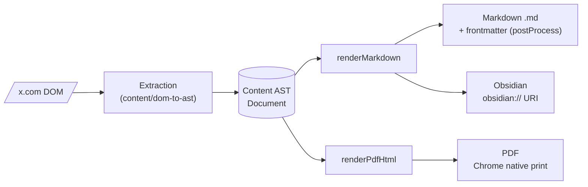
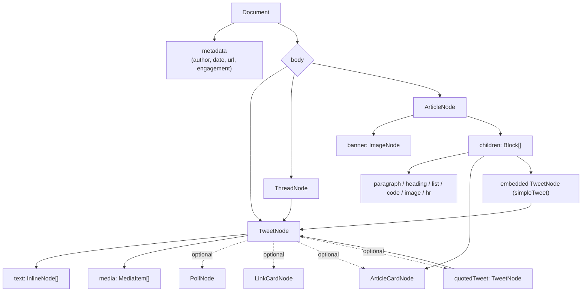
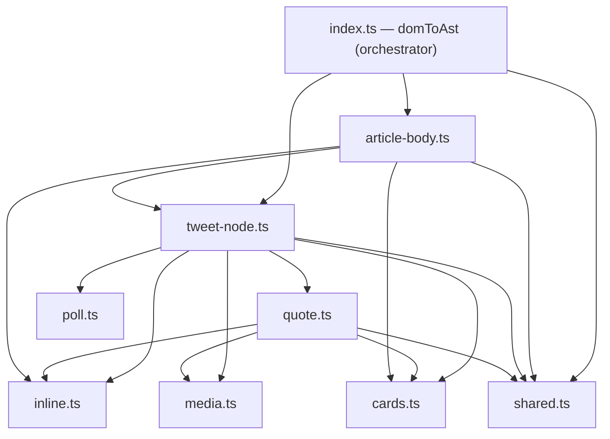
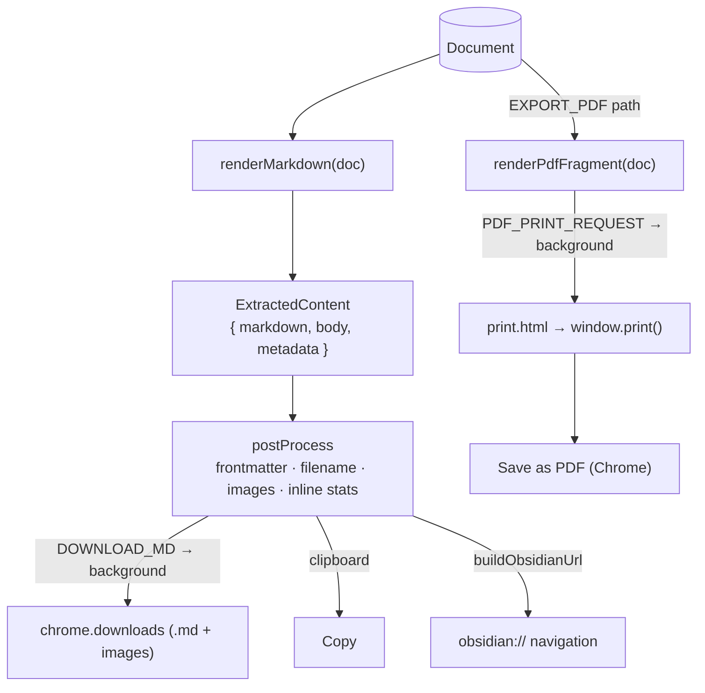
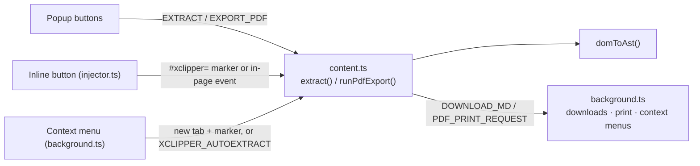
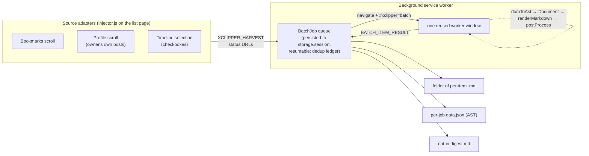

# XClipper architecture

A living overview of how XClipper turns x.com pages into Markdown, PDF, and
Obsidian notes — one item at a time or in batch. For the per-node AST contract
see [`ast-schema.md`](./ast-schema.md); for *why* the AST exists see
[`adr/0001`](./adr/0001-content-ast-architecture.md).

## The one diagram

Everything is one shape: **DOM → Content AST → renderers**. The AST is the only
source of truth; renderers never touch the DOM.

Three planes, each independently testable:

| Plane | Lives in | Input → Output | Knows about |
|---|---|---|---|
| **Extraction** | `content/dom-to-ast/` | DOM `Element` → `Document` | X's DOM quirks only |
| **Rendering** | `ast/` | `Document` → string (MD / HTML) | the AST only |
| **Orchestration** | `content/`, `popup/`, `background/` | user intent → message → file | Chrome APIs, settings |

The seam that makes scaling possible: `Document` is **JSON-serializable** and
already crosses the `chrome.runtime` message boundary inside `ExtractedContent`.
ASTs can be produced in one context, collected, and rendered in another.

## Content AST — node relationships

What gets extracted and how the nodes nest. Full field-level contract in
[`ast-schema.md`](./ast-schema.md).

Two recursions matter: a tweet can **quote** another tweet, and an article can
**embed** a full tweet. Both reuse `TweetNode`, so any renderer that handles a
tweet handles quotes and embeds for free.

## Extraction module map (`content/dom-to-ast/`)

A clean dependency DAG. The orchestrator (`index.ts`) and two composing nodes
(`tweet-node.ts`, `article-body.ts`) wire together the leaves — `inline`,
`cards`, `media`, `poll`, and the tiny `shared` helpers — none of which import
another `dom-to-ast` module. `quote.ts` sits between: it composes the leaves but
is itself only consumed by `tweet-node`. `articleToTweetNode` is the hub, used by
both the tweet path and, via `simpleTweet`, the article path.

`domToAst()` dispatches: article page → `articleDocument()`; otherwise it
collects the same-author run of `<article>` elements (the thread) and maps each
through `articleToTweetNode()`.

## Output pipelines

All three start from one `Document`. Markdown is rendered **once** in the content
script; `postProcess` then shapes it per the user's settings.

- **Markdown / Copy / Obsidian** share the markdown plane. `postProcess` prepends
  YAML frontmatter (default or Obsidian-friendly schema, per-field toggles),
  resolves local images, and builds the filename. Obsidian just delivers that
  same markdown through an `obsidian://` URI instead of a file.
- **PDF** is a separate plane: AST → HTML fragment → handed to the background
  worker, which opens an extension-origin `print.html` and calls `window.print()`.
  It never touches markdown or `postProcess`. (See ADR 0001 → "Renderer decisions".)

## Orchestration & entry points

Three ways in, one extractor. Every trigger converges on `content.ts`.

`background.ts` is the privileged hub: it owns `chrome.downloads` (with sender
validation + path sanitization), the context menus, the PDF print tab, and the
one-time `tweet2md → xclipper` settings migration. `shared/` holds logic both the
popup and content script need (`post-process`, `settings`, `media`, `obsidian`).

## Batch export (shipped in v2.1.0)

Export many tweets/threads/articles in one job, sourced from **bookmarks**, a
**profile**, or a **timeline selection**. Batch is not a second pipeline — it is
the single-permalink flow run N times, so fidelity is identical by construction.
The rationale and the choices behind it live in
[`adr/0002`](./adr/0002-batch-export-architecture.md); this is the shape.

Three stages: *source adapters* harvest status URLs → a *background-owned
orchestrator* drives one worker window through each permalink → *sinks* write the
results.

How the stages map onto the single-item architecture above — everything below the
orchestrator, and every renderer, is reused unchanged:

| Stage | Responsibility | Reuses |
|---|---|---|
| **Source adapter** | scroll a list page, collect `a[href*="/status/"]` + light metadata | `injector.js` (already on all of x.com); depends only on status-link hrefs, so it survives X markup churn |
| **Orchestrator** | sequential job queue, throttle, pause/resume/stop, per-item failure recording | the background — the only context that survives popup close and owns tabs/windows |
| **Worker window** | navigate to each permalink, extract on load, report the result | the `#xclipper=` auto-extract hash, plus `domToAst` and every renderer unchanged |
| **Sink** | write per-item `.md`, a per-job `data.json`, and an opt-in `digest.md` | `postProcess` per item; `renderDigest(docs)` joins already-rendered documents |

### Positions taken (see ADR 0002 for the full table)

- **Visit every permalink; never parse list cells.** A thread's root tweet is
  rendered identically to a standalone tweet in a bookmarks cell — there is no DOM
  signal that more tweets follow. Thread membership is only knowable after loading
  the permalink, which is exactly what the single-item extractor already does. One
  extractor, one fixture suite, full fidelity for threads/articles/quotes/polls.
- **The orchestrator lives in the background, not the popup.** Only the service
  worker survives popup close. Job state is persisted to `chrome.storage.session`
  after every item, so an MV3 worker restart resumes rather than orphaning a
  half-done batch.
- **One reused, unfocused worker *window*** (not a hidden tab): Chrome never paints
  hidden tabs, so X's virtualized timeline wouldn't mount thread-continuation
  tweets or hydrate lazy media. An unfocused-but-visible window keeps rendering
  without stealing focus.
- **Stream each result to the sink as it completes.** ASTs are not accumulated in
  memory, so large batches stay bounded and partial output survives a crash.
- **A dedup ledger** of exported status ids (`chrome.storage.local`, capped at
  5000) lets the popup count "(N new)" and skip already-exported items; a Reset
  control clears it.

State lives in `src/background/batch.ts` and `batch-state.ts`; the harvest and
selection message contracts are in `src/types/messages.ts`.
